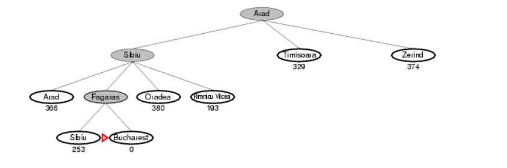

## Introduction

Best First Search is an informed search algorithm that tries to expand the node that is closest to the goal, on the grounds that this is likely to lead to a solution quickly. Thus, it evaluates nodes by using just the heuristic function; that is, f(n) = h(n). f(n) is an evaluation function to estimate the desirability of a node to lead to a quick solution. It is widely used in various applications, including pathfinding, puzzle solving, and optimization problems.

## Algorithm

The Best First Search algorithm starts with an initial node and uses a heuristic function to evaluate the potential of each node. The heuristic function provides an estimate of the cost of the cheapest path from the state at node n to a goal state. The algorithm maintains a priority queue to store the open (unexplored) nodes, where the node with the lowest heuristic value is considered the most promising.

Here are the steps for the Best First Search algorithm:

STEP 1: Initialize an empty priority queue and insert the initial node.
STEP 2: While the priority queue is not empty, do the following:
a. Remove the node with the highest priority (based on the heuristic value) from the priority queue.
b. If the node is the goal node, terminate the search and return the solution.
c. Expand the selected node by generating its neighboring nodes.
d. Evaluate the heuristic value for each generated node.
e. Insert the generated nodes into the priority queue based on their heuristic values.
STEP 3: If the priority queue becomes empty and no solution is found, terminate the search and conclude that no solution exists.

## Heuristic Function

The heuristic function (h(n)) plays a crucial role in the Best First Search algorithm. It provides an estimate of the desirability of a node and guides the search towards the most promising nodes. h(n) = estimated cost of the cheapest path from the state at node n to a goal state. The choice of heuristic function depends on the problem domain and the specific criteria or constraints. The heuristic function should be admissible, meaning it never overestimates the cost to reach the goal, and preferably also consistent, meaning the estimated cost of reaching a neighboring node is not greater than the cost of reaching the node itself plus the estimated cost from that neighboring node to the goal. A heuristic h(n) is admissible if for every node n,
h(n) ≤ h*(n), where h*(n) is the true cost to reach the goal state from n.

## Example 

**Path from Arad to Bucharest:**
The first node to be expanded from Arad will be Sibiu because it is closer to Bucharest than either Zerind or Timisoara. The next node to be expanded will be Fagaras because it is closest. Fagaras in turn generates Bucharest, which is the goal.

****Time and Space Complexity: O(b^m)**
In the worst case, Best-First Search may need to explore all the nodes in the search space before reaching the goal state. Since the search space can have a maximum of 'b^m' nodes (where 'b' is the branching factor (the maximum number of children any node can have) and 'm' is the maximum depth of the search space), the worst-case time complexity of Best-First Search is O(b^m). Best-First Search may need to store all the nodes from the root to the deepest level in the search space.Therefore, the worst-case space complexity is also O(b^m). This happens when the goal state is located at the maximum depth and every node needs to be explored. 

## Advantages 

Efficiency: Best First Search can be highly efficient as it uses heuristics to guide the search towards the most promising nodes, reducing the search space.
Flexibility: The algorithm can be customized by selecting different heuristic functions to suit the problem at hand.

## Disadvantages

Heuristic Quality: The effectiveness of Best First Search heavily relies on the quality of the heuristic function. A poor or inaccurate heuristic can lead to suboptimal or incorrect solutions.
Optimality: Best First Search is not optimal. In the above example, the solution is not optimal, as the path via Sibiu and Fagaras to Bucharest is 32 kilometers longer than the path through Rimnicu Vilcea and Pitesti.
Completeness: Best First Search is not guaranteed to find a solution if one exists, especially in cases where the heuristic is not well-informed or the search space is infinite.
Time and Memory Complexity: The average value of time and memory complexity of Best First Search can vary depending on the heuristic function and the structure of the problem.
 
